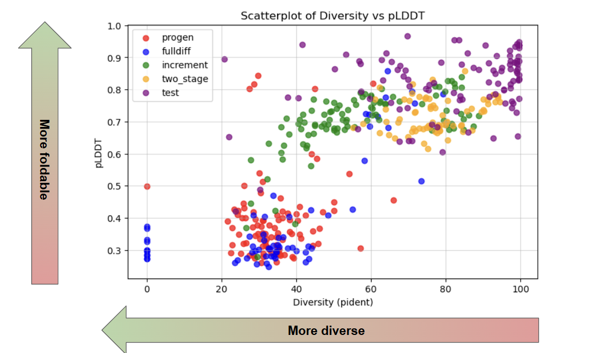
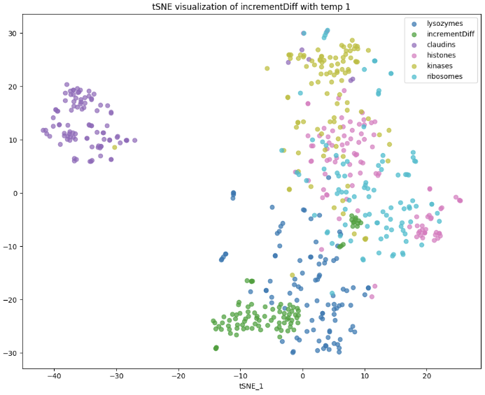
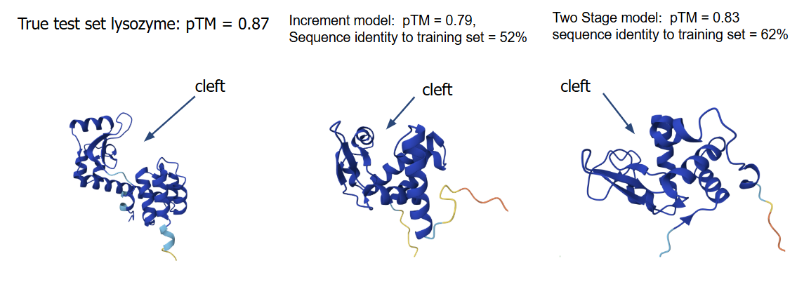

# Discrete Space Diffusion: A Different Method for Protein Sequence Generation using LLMs

## Overview

This project encompasses our work in applying discrete space diffusion for protein language models to generate developable lysozymes. Building off of the original Diffusion Protein Language Model (DPLM) paper for the model architecture, we build 3 training schemes to train the model on the sequence diffusion task. The three schemes are Full Diffusion, Two Stage Diffusion and Incremental Diffusion. The first two training schemes are from our implementations of the training schemes detailed in DPLM. Incremental Diffusion is a training scheme we propose to fix some of the limitations in the other two. We find that the model trained on Incremental Diffusion improves its ability to generate outside of its training set while maintaining high foldability and low generative perplexity. 

## Inference

First install the requirements file
```sh
pip install -r requirements.txt
```

Next, download the model weights from each training scheme [here](https://drive.google.com/drive/folders/1nfjkp3n-Xve_MR8dC0CIKF95sGU8pXd3?usp=drive_link)

Finally, run the following script 'generate_script_commands.py' with the commands lines below:

```bash
python /home/en540-lludwig2/ProMDLM/generate_script_commands.py \
  --weight_path 'path_to_full_diff_weights path_to_increment_diff_weights' \
  --save_names 'full_diff increment_diff'  \
  --temp '0.5 1 1.5' \
  --save_dir 'my_outputs_new' \
  --max_iter 100 \
  --generation_length 160 \
  --nb_generated_sequences 1 \
  --resample_ratio 0.3 \
  --device 'cuda'
```

## ProGen_Finetune

In our evaluation we finetune ProGen to compare to our sequence space diffusion approach. Code for finetuning ProGen can 
be found [here](https://github.com/hugohrban/ProGen2-finetuning).

## Results

We evaluated our Incremental Diffusion method (Increment) on it's ability to generate Lysozymes. We tested our training scheme against the two training schemes from the DPLM paper, Full Diffusion (fullDiff) and Two Stage Diffusion (two_stage). We also compared our method to ProGen that we trained on the split of our custom dataset of Lysozyme sequences and a randomly selected pool of Lysozyme sequences from the test split of our custom dataset. 

We started by generating or selecting 100 sequences from the different methods. Since certain methods could generated repetitive sequences we applied a sequence entropy cutoff of 3.5, where the sequences that passed moved on with the evaluation.


Next, we compared the following metrics: pident (diversity), foldability (pLDDT) and psuedo_perplexity using ESM 650M parameters plotted on the following scatterplots.




From ESM, we also construct a tSNE plot to visualize ESM embedding space of generated lysozymes (green) compared to real lysozymes (blue) and other protein families.



Finally, we investigate the hit rate of generated Lysozyme sequences across the different training schemes. We consider a sequence as "developable" if it has > 0.7 plddt and < 80 diversity (pident) and > 3.5 entropy.


From these results, we see that IncrementDiff and two_stage generate sequences with pseudo-perplexity similar to the testing set while also remaining diverse. IncrementDiff also generates foldable sequences with high diversity compared to the other methods tested. From the tSNE plot, IncrementDiff generations also occupy their own cluster close to the lysozyme family within the ESM Embedding space. Finally, generated sequences from our IncrementDiff are the most developable. 

Finally, using Alphafold3 we qualitatively analyzed folded representations of our generated sequences from our IncrementDiff training and the DPLM Two Stage Training against a true Lysozyme. From the folds below we can see that the generated sequences adopt a similar celft which is representative of Lysozyme proteins.




## Sources

DPLM paper: 
Wang, X., Zheng, Z., Ye, F., Xue, D., Huang, S., & Gu, Q. (2024, October 16). Diffusion language models are versatile protein learners. arXiv.org. https://arxiv.org/abs/2402.18567 

## License
MIT License. See LICENSE file for details.

